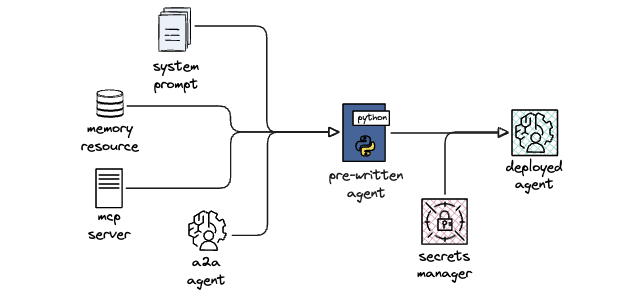
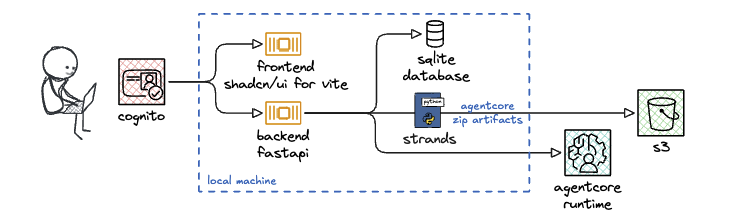
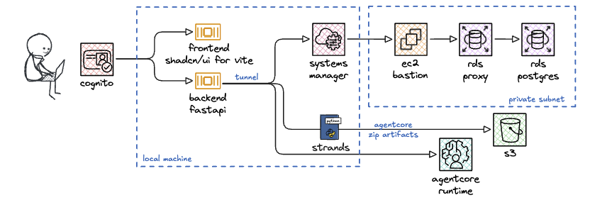
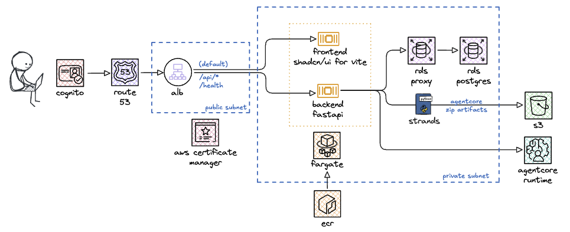

# Loom

Loom is an enterprise-grade platform for building, deploying, and operating AI agents on Amazon Bedrock AgentCore Runtime and AWS Strands Agents. It provides a unified management UI with Cognito-based authentication, scope-based authorization, multi-persona navigation, and full lifecycle management for agents, memory, MCP servers, A2A integrations, and AWS Agent Registry governance.

## Features

Loom seamlessly stitches together agents, memory stores, MCP servers, and agent-to-agent integrations in a unified platform. It handles the complexity of IAM roles, credential providers, authentication flows, and resource tagging — making it simple to deploy agents with full observability and cost tracking from day one.



### Agent Lifecycle
- Deploy new agents or import existing AgentCore Runtime agents
- SSE streaming invocation with real-time response display
- Progressive deployment status tracking and async deletion
- Cold-start latency measurement via CloudWatch log parsing
- Active session tracking with idle timeout heuristic

### Memory Management
- Create and manage AgentCore Memory resources
- Configurable strategies: semantic, summary, user preference, episodic, custom

### MCP Servers
- Register and manage MCP servers with tool discovery
- OAuth2 authentication and credential provider support
- Per-persona access control (all_tools or selected_tools)

### A2A Agents
- Register Agent-to-Agent protocol agents by base URL with automatic Agent Card fetching
- Structured Agent Card display: capabilities, authentication schemes, input/output modes, skills
- OAuth2 authentication with test connection
- Per-persona access control (all_skills or selected_skills)
- A2A runtime client with OAuth2 Bearer token injection via AgentCore Identity service
- Handles both SSE streaming and plain JSON responses with automatic method fallback
- Credential provider creation with exponential backoff retry for reliable deployment

### Agent Registry (Opt-In Governance)
- AWS Agent Registry integration for governance and discovery — opt-in via Settings page (ARN configuration)
- When enabled, provides additional governance: agents, MCP servers, and A2A agents must be approved before use
- Agents auto-registered in DRAFT status on deployment; admins manage approval workflow
- Full record lifecycle: create, submit for approval, approve, reject, delete
- Descriptor builders for agents, MCP servers, and A2A agents
- Semantic search over registry records via data plane API
- Visibility filtering: end-users see only APPROVED or unregistered resources
- Integration gating: only APPROVED MCP servers and A2A agents can be selected for agent deployments

### Security and Access Control
- Cognito user authentication with automatic token refresh
- Two-dimensional group-based authorization: Type groups (t-admin, t-user) for UI view and Resource groups (g-admins-*, g-users-*) for access control (21 scopes total)
- IAM role, authorizer, and credential management
- Admin user view switching to preview scoped experiences

### Platform Catalog and Tagging
- Unified catalog view across agents, memory, MCP servers, and platform resources
- Configurable tag policies (platform + custom) and named tag profiles
- Tag badges with filtering and persistent state

### Token Usage and Cost Tracking
- Per-invocation token counting via Bedrock CountTokens API (Anthropic/Meta models) with 4 chars/token heuristic fallback
- Cost dashboard with time-range selector and per-agent breakdown
- Cost badges on agent cards, token/cost columns in invocation tables
- Model pricing metadata for all supported Anthropic and Amazon models

### Admin Dashboard
- Platform usage analytics for super-admins: login tracking, user action tracking, and page navigation tracking
- All audit events are scoped to a browser session UUID (generated at login, stored in React state) to distinguish shared accounts
- Global multi-select user filter that limits all summary cards, charts, and tab tables to selected users; stats are recomputed client-side from filtered data when active
- Summary cards (total logins, total page views, total actions, total duration, most active page) with time-range selector
- Charts: logins over time, actions over time, page views by page (recharts)
- Per-session drill-down: interleaved timeline of logins, actions, and page views for any browser session
- 27 instrumented action types across agent, memory, security, tagging, MCP, and A2A categories

### Observability and UX
- OpenTelemetry observability with ADOT auto-instrumentation and OTEL trace visualization
- Interactive waterfall timeline for inspecting per-span events from OTEL log records
- Card/table view toggle on all listing pages
- Estimated cost column in agent and memory table views; consistent 5-column layout for MCP and A2A tables
- Drag-to-reorder cards with persistent ordering
- JSON import/export on deploy and create forms
- 10 color themes (5 light, 5 dark) with WCAG AA contrast compliance, and timezone-aware timestamps

## Project Structure

```
loom/
├── agents/            # Agent blueprint source code (Strands Agent)
├── backend/           # FastAPI backend (Python, SQLAlchemy, boto3)
│   ├── etc/           # Backend environment config (app + ECS backend service)
│   └── iac/           # Backend infrastructure (RDS, EC2 bastion, ECS backend service)
├── frontend/          # React/TypeScript frontend (Vite, shadcn, Tailwind CSS)
│   ├── etc/           # Frontend environment config (ECS frontend service)
│   └── iac/           # Frontend infrastructure (ECS frontend service)
├── shared/            # Shared IaC (IAM roles, Cognito, DNS, infra, ECS cluster) + deployment makefile
│   └── etc/           # Shared environment config (Cognito, infra, DNS)
└── SPECIFICATIONS.md  # Project-level specification
```

See [`backend/SPECIFICATIONS.md`](backend/SPECIFICATIONS.md) and [`frontend/SPECIFICATIONS.md`](frontend/SPECIFICATIONS.md) for detailed component specifications.

## Architecture

- **Backend:** FastAPI with SQLAlchemy (SQLite for local dev, PostgreSQL/RDS for cloud), boto3 for AWS, SSE streaming via `StreamingResponse`
- **Infrastructure:** SAM templates — shared (DNS, S3, ECR, ACM, ALB, ECS cluster) in `shared/iac/`, frontend ECS service in `frontend/iac/`, backend (RDS, EC2 bastion, ECS service) in `backend/iac/`
- **Containers:** Dockerfiles for both frontend (multi-stage Node + nginx) and backend (Python 3.13 slim + uvicorn + agent source from repo root), deployable to ECS Fargate behind an ALB with ACM certificate
- **Frontend:** React 18, TypeScript, Vite, shadcn/ui, Tailwind CSS v4
- **Auth:** Cognito User Pool with group-based scopes; frontend enforces sidebar visibility and write permissions
- **Navigation:** Platform Catalog, Agents, Memory, Security Admin, MCP Servers, A2A Agents, Tags, Costs, Settings, Admin Dashboard (super-admins only)

## Deployment

Loom supports a progressive deployment model with three phases:

### Phase 1: Local Testing with Cognito

Develop and test the full Loom UI locally with SQLite (zero-config database) and Cognito authentication.  
**What you can do:** Deploy and invoke agents, manage memory and MCP servers, iterate quickly with hot-reload on both frontend and backend — all without deploying any compute infrastructure to AWS.



### Phase 2: Hybrid Deployment with RDS

Deploy RDS PostgreSQL to AWS and connect via SSM tunnel while still developing locally.  
 **What you can do:** Test with production-grade PostgreSQL, share a centralized database across team members, validate data persistence and migration strategies, and prepare for full cloud deployment — all while maintaining fast local iteration cycles.



### Phase 3: Full Deployment to AWS

Deploy the entire stack (frontend, backend, database) to AWS ECS Fargate behind an Application Load Balancer.  
**What you can do:** Run Loom as a production-ready, fully managed service accessible via HTTPS with custom domain, enable your team to access Loom from anywhere without local setup, leverage auto-scaling for the backend, and operate with enterprise-grade security, observability, and high availability.



See [DEPLOYMENT.md](DEPLOYMENT.md) for detailed deployment instructions.
